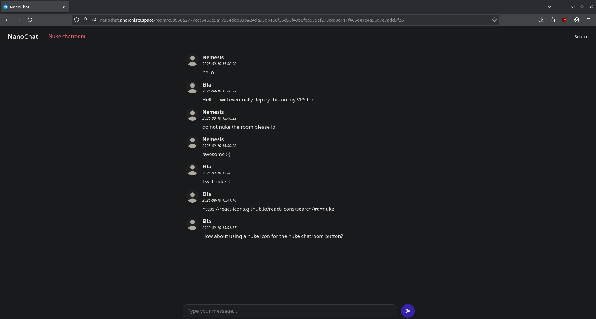

# NanoChat

## An end-to-end encrypted anonymous webchat

<!-- FEATURES -->

## Features

- Small codebase
- Messages expire after 30 days
- Docker support

## Technical details

- AES-256-GCM for client-side encryption
- Key is not sent to server

<!-- INSTALLATION -->

## Installation

First, clone the repository:

    git clone https://github.com/NanoChatOfficial/NanoChat.git

### Backend setup

    cd NanoChat/backend/
    python3 -m pip install --user pipenv
    pipenv --python $(which python3)
    python3 -m pipenv sync
    python3 -m pipenv shell
    python manage.py runserver

### Backend setup with Docker

    cd NanoChat/
    sudo docker build --network=host -t nanochat .
    sudo docker run --network=host --name nanochat nanochat

### Frontend setup

    cd NanoChat/frontend/
    pnpm install
    pnpm build
    pnpm run preview

_For the development server, run `pnpm run dev` instead of `pnpm run preview`._

**Note:**
_By default, the backend server runs on port `8000` and the frontend runs on port `5173`._

<!-- REQUIREMENTS -->

## Requirements

### Backend

- [Python](https://www.python.org/downloads/)
- [pipenv](https://pypi.org/project/pipenv/)

### Frontend

- [node.js](https://nodejs.org/en/download/) (install with pnpm)

### Optional

- [Docker](https://docs.docker.com/engine/) (for Docker deployment)

<!-- SCREENSHOT -->

## Screenshot

<!-- LICENSE -->

## License

Distributed under the MIT License. See `LICENSE` for more information.
