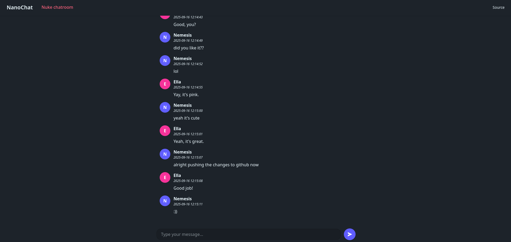

# NanoChat

## An end-to-end encrypted anonymous webchat

<!-- FEATURES -->

## Features

- Small codebase
- Messages expire after 30 days
- Panic button to delete all messages in a room
- WebSocket for communication
- Docker support

## Technical details

- AES-256-GCM for client-side encryption
- Key is not sent to server

<!-- INSTALLATION -->

## Installation

First, clone the repository:

    git clone https://github.com/NanoChatOfficial/NanoChat.git

### Onion service setup with Docker

    cd NanoChat/
    sudo docker compose build --no-cache
    sudo docker compose up

### Backend setup

    cd NanoChat/backend/
    python3 -m pip install --user pipenv
    pipenv --python $(which python3)
    python3 -m pipenv sync
    python3 -m pipenv shell
    pipenv install
    export DJANGO_SETTINGS_MODULE=backend.settings
    daphne backend.asgi:application --port 8000

### Frontend setup

    cd NanoChat/frontend/
    npm install pnpm
    pnpm install dompurify
    pnpm build
    pnpm run preview

<!-- REQUIREMENTS -->

## Requirements

### Backend

- [Python](https://www.python.org/downloads/)
- [pipenv](https://pypi.org/project/pipenv/)

### Frontend

- [node.js](https://nodejs.org/en/download/) (install with pnpm)

### Optional

- [Docker](https://docs.docker.com/engine/) (for Docker deployment)

<!-- SCREENSHOT -->

## Screenshot

<!-- LICENSE -->

## License

Distributed under the MIT License. See `LICENSE` for more information.
